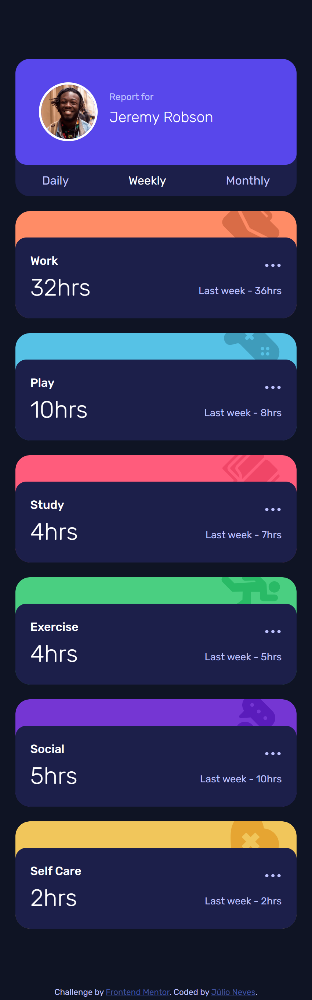
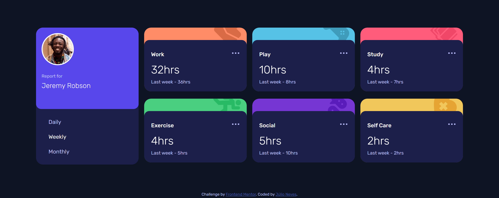

# Time tracking dashboard solution

It was developed with HTML, CSS and Javascript.

Built with eleventy.

## Table of contents

- [Overview](#overview)
  - [The challenge](#the-challenge)
  - [Screenshot](#screenshot)
  - [Links](#links)
- [My process](#my-process)
  - [Built with](#built-with)
  - [What I learned](#what-i-learned)
- [Author](#author)

## Overview

### The challenge

Users should be able to:

- View the optimal layout for the site depending on their device's screen size
- See hover states for all interactive elements on the page
- Switch between viewing Daily, Weekly, and Monthly stats

### Screenshot

Mobile version

Desktop version

### Links

- [Solution URL](https://github.com/jcnevess/time-tracking-dashboard)
- [Live Site URL](https://jcnevess.github.io/time-tracking-dashboard)

## My process

### Built with

- CSS custom properties
- Flexbox
- CSS Grid
- Mobile-first workflow
- Eleventy

### What I learned

This was my first time using `CSS grid` in something which was not a tutorial.

## Author

- Website - [Júlio Neves](https://jcnevess.github.io/)
